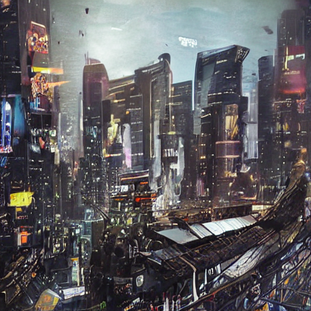
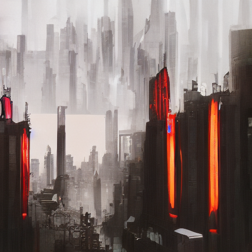
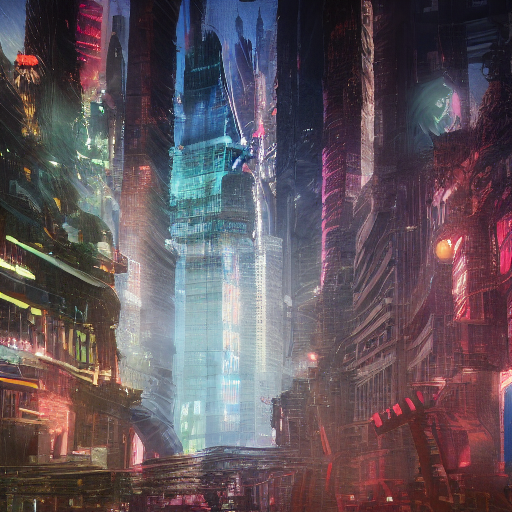
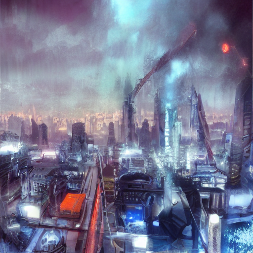

# Stable-Diffusion-Pytorch

## Overview
This is an educational repository on fine-tuning publicly available Stale-Diffusion model at HuggingFace. The repository includes a custom Stable-Diffusion Model class configurable for both conditional and unconditional image training. Compared to other impressive Pytorch implementations of Stable-Diffusion, of which there are many, this repository aims to provide an easy framework to work with Stable-Diffusion model on fine-tuning tasks rather than implement from scratch, out of consideration for computational resources and redundancy. 

The curren repository is available to fine-tune on conditional or unconditional fine-tuning. For future developments, this repository will aim to expand the fine-tuning framework to Image-to-Image translation, Image inpainting, and other areas within reason. Results are, or will be, shown below along with instructions on usage and deploymnet.

## Visual Results
<div style="display: flex; justify-content: center; flex-wrap: wrap; gap: 20px; max-width: 90%; margin: 0 auto;">
    <div style="display: flex; justify-content: center; flex-basis: 100%; flex-wrap: wrap;">
        
        
        
    </div>
    <div style="display: flex; justify-content: center; flex-basis: 100%; flex-wrap: wrap;">
        
        
        
    </div>
</div>

## Planned Features
- **Image-to-Image Translation**
  - Enable the model to generate variations of a given input image by fine-tuning it for image-to-image translation tasks.
- **Image Inpainting**
  - Extend the framework to support inpainting tasks, allowing users to repair or complete partially damaged or missing sections of images.
- **Textual Inversion Integration**
  - Integrate support for textual inversion, enabling users to fine-tune the model to learn and generate specific styles or concepts based on new text prompts.
- **Multi-GPU Training**
  - Add support for distributed data parallel (DDP) to leverage multiple GPUs efficiently. 
- **Better Dataset for Cyberpunk Style finetuning**
  - Add supporting utils and scrapping functions to create quality datasets from unlabeled data.

## Usage
Training Script: train.py

To fine-tune the model using the train.py script, the following command-line arguments are required:
```--root``` (type: str, required): Specifies the root directory containing the dataset for fine-tuning.
```--csv``` (type: str, required): Path to the CSV file containing image captions paired with their respective images.
```--epoch``` (type: int, optional, default: 10): Number of epochs to run for fine-tuning.
```--sav```e (type: str, required): Path where the model checkpoints will be saved.
```--config``` (type: str, required): Path to the configuration file specifying model and training parameters.

Example Usage:
```bash
python train.py \
    --root /path/to/dataset \
    --csv /path/to/captions.csv \
    --epoch 20 \
    --save /path/to/save/checkpoints \
    --config /path/to/config.json
```